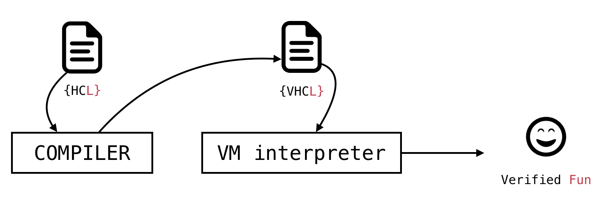

HCL (Hoare Command Language) is a programming language that aims to provide a framework to explore ideas related to formal methods for software, software verification, and program derivation. Based on the ideas of Dijkstra, Hoare, and Dahl. HCL is an extended compiler for the Disjktra's GCL program definition language. It is composed of a virtual machine (VHCL), and the compiler that generates VM code. The later is where the semantics and verification procedures resides. The former translates an HCL program, to a VHCL file with the same semantics as the original file. Having a virtual machine allow us to take memory snapshots that serves as a material for a rigorous verification that the program does meet an specification. 

The main goals of HCL are:

* Provide a computer language to express ideas written in GCL ([Guarded Command Language](https://en.wikipedia.org/wiki/Guarded_Command_Language)), and understand the basics of [axiomatic semantics](https://en.wikipedia.org/wiki/Axiomatic_semantics).
* Serve as a research canvas about novel verification schemes using a well-defined and a manageable programming language as a basis.

## Why does HCL exists?

Axiomatic semantics, Hoare-Floyd logic, and Dijkstra's ideas for structured programming and program derivation and specification, are sometimes viewed as impractical and old standards for software engineering. Conversely to that, we do think, that those ideas provide a basis to rigorous software engineering without the need of fancy tools, but providing programmers with a mental abstraction to reason about pieces of code. 

Real programming languages, does not provide standard libraries to reason about software or complex assertion predicates. The focus of the popular programming languages, is to give a tool to develop real software; thinking about software does not goes well with real software engineering. HCL is a simple, small but yet powerful tool to reason about simple programs; the same programs that we all learnt about while we're learning to program a computer.

## How does HCL look like?

HCL has two parts, the compiler, and the VM code interpreter. The compiler job is to generate files that the VM interpreter can understand preserving the semantics of both the verification commands, and the code. The job of the VM interpreter is to check whether or not the program meets the specification and at the same time, run the code.



The following program, reads a number, and prints the fibonacci numbers up to `fib(n)`. The following figures shows both the code written in HCL and the compiled version to be interpreted by the VM.


```pascal
program fibonacci
begin
    var f0, f1, ft, n, i : int
    var newline : char
    newline ← "\n"

    read(n)
    print newline

    f0, f1, i, ft ← 0, 1, 0, 0
    
    do i < n →
        ft ← f0 + f1
        f0, f1 ← f1, ft
        i ← i + 1 

        print f0
        print newline
    od    
end
```

```assembly_x86
;; fibonacci.vhcl : Autogenerated file by HCL Compiler v1.0

;; Auxiliar character defintion
;; Space character
set _sysspace char
;; New Line character
set _sysnl char
;; Space character initialization
mov _sysspace 100000
;; New Line character initialization
mov _sysnl 001010

;; General variable defintion
set f00 integer
set f10 integer
set ft0 integer
set i0 integer
set newline0 char
set n0 integer

;; General program execution routine

mov newline0 _sysnl
readint n0
print newline0
mov f00 0
mov f10 1
mov i0 0
mov ft0 0
do:
	gss _do0guard0
	clc:
		cmp i0 n0
		slt:
			mov .r4int 1
		geq:
			mov .r4int 0
		mov _do0guard0 .r4int
	act _do0guard0:
		mov .r3int f00
		add .r3int f10
		mov ft0 .r3int
		mov f00 f10
		mov f10 ft0
		mov .r3chr i0
		add .r3chr 1
		mov i0 .r3chr
		print f00
		print newline0
halt
```

## Status

## The architecture of HCL

## Contributing

## Authors

## License